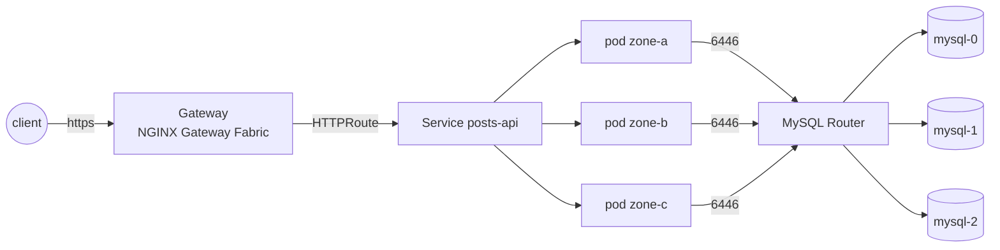

# infrastructure-interview

[](https://github.com/ArthurSampaio13/infrastructure-interview/actions/workflows/ci.yaml)
[](https://github.com/ArthurSampaio13/infrastructure-interview/releases)

A posts API (Express, TypeORM, MySQL) packaged and deployed the way it would run in production:
containerized, highly available across three zones, observable, and reproducible from one command
on a local kind cluster.

## Table of contents

- [About](#about)
- [Changes to the original app](#changes-to-the-original-app)
- [Built with](#built-with)
- [Getting started](#getting-started)
- [Usage](#usage)
- [Testing](#testing)
- [Releases](#releases)
- [Design decisions](#design-decisions)
- [Repository layout](#repository-layout)

## About



Requests enter through a Gateway API `Gateway` served by NGINX Gateway Fabric, with TLS from a
local CA. The app runs three replicas spread across zones behind a PodDisruptionBudget and an HPA.
MySQL is a three-instance InnoDB Cluster, one per zone, reached through MySQL Router. Prometheus,
Grafana, Loki and Alloy cover metrics and logs. The platform is OpenTofu and Terragrunt; the app is
a Helm chart.

See [docs/architecture.md](docs/architecture.md).

## Changes to the original app

The challenge shipped a single-file Express app: TypeORM 0.2 on an end-of-life Node line,
credentials in a committed `ormconfig.env`, `synchronize: true`, no health checks, and
`console.log` for logging. The changes below let a platform team run it without reading its code.

| Change | Why | Where |
| --- | --- | --- |
| Node 22, TypeScript 5, TypeORM 0.3, `mysql2` | supported runtimes; distroless images ship only those | `app/package.json` |
| Configuration from environment variables, validated at start | no credentials in the repo; the Kubernetes Secret is the contract | `app/src/config.ts` |
| Migrations instead of `synchronize` | schema changes are reviewed, run once by a Helm hook, with a DDL-only database user | `app/src/migration/`, `charts/posts-api/templates/job-migrate.yaml` |
| `/healthz`, `/readyz`, `/metrics` on port 9464 | probes and scraping stay off the public port; readiness checks the database | `app/src/ops.ts` |
| Graceful shutdown on SIGTERM | in-flight requests finish during a rollout or an eviction | `app/src/index.ts` |
| JSON logs with a request id | one line per request, searchable in Loki by `request_id` | `app/src/logger.ts`, `app/src/app.ts` |
| Body validation, 100 kB limit, security headers, central error handler | 400 and 413 for bad input, 500 without a stack trace | `app/src/app.ts`, `app/src/routes.ts` |
| Pagination on `GET /posts` | the table is never returned whole | `app/src/routes.ts` |
| `POST /posts` returns 201; the `next` bug fixed | the original returned 200 and never called `next` after a handler | `app/src/routes.ts` |

The API surface is unchanged otherwise. See
[docs/architecture.md](docs/architecture.md#application) and
[docs/design-decisions.md](docs/design-decisions.md#app-modernization-node-22-typeorm-03-typescript-5).

## Built with

| Tool | Version | Role |
| --- | --- | --- |
| kind | 0.30.0 (Kubernetes 1.34.0) | local cluster, 1 control plane + 3 workers |
| OpenTofu / Terragrunt | 1.11.5 / 1.1.0 | platform provisioning |
| Helm | 4.0.4 | app chart |
| NGINX Gateway Fabric | 2.6.7 | Gateway API implementation |
| cert-manager | 1.21.1 | local CA and TLS |
| MySQL Operator | 2.3.0 | InnoDB Cluster and Router |
| kube-prometheus-stack / Loki / Alloy | 88.6.1 / 7.3.0 / 1.12.1 | metrics, logs |
| Node.js / Express / TypeORM | 22 / 4 / 0.3 | the API |
| k6 | 1.3.0 | smoke, load and chaos tests |
| Trivy / cosign | 0.69.2 / 3.0.6 | image scan and signature |

`mise.toml` and `infra/environments/common/addons.yaml` pin these versions.

## Getting started

Requirements: Docker, [mise](https://mise.jdx.dev), 8 GB of RAM, ports 80 and 443 free, and on
Linux or WSL2 the inotify limits raised ([docs/getting-started.md](docs/getting-started.md) has the two `sysctl` lines).

```bash
make setup    # install pinned tools, register pre-commit hooks
make up       # kind cluster + platform addons + mysql + build + deploy (about 17 min)
make hosts    # add posts.local.test and grafana.local.test to /etc/hosts (sudo)
make test     # k6 smoke test
```

See [docs/getting-started.md](docs/getting-started.md) for what each step does and first-run
problems.

## Usage

| URL | What |
| --- | --- |
| `https://posts.local.test/posts` | the API |
| `https://grafana.local.test` | Grafana; `make grafana` prints the password |

| Target | What |
| --- | --- |
| `make load` | k6 load test; SLO: errors < 1%, p95 < 300 ms |
| `make chaos` | four failure scenarios under load |
| `make drain NODE=<name>` | drain a node, PDB-aware |
| `make deploy REGISTRY=private TAG=<version>` | pull from the private repository |
| `make down` | destroy everything |

Runbooks (failover, full outage recovery, password rotation, alerts):
[docs/operations.md](docs/operations.md).

## Testing

A k6 smoke test covers every route and error code. A k6 load test holds a mixed read/write load
against an SLO. Four chaos scripts (zone outage, MySQL primary kill, rolling upgrade, random pod
kill) run that load test while injecting the fault and fail on the same SLO. Results per version,
including the runs that failed and why, are in [docs/testing.md](docs/testing.md).

## Releases

CI runs lint, build, scan, chart and infra checks on every pull request and every push to `develop`
or `main`. A `v*` tag scans a build, then pushes a multi-arch image to `docker.io/skizay/posts-api`
(and a private copy), signs both with cosign, and pushes the chart to
`oci://ghcr.io/arthursampaio13/charts`. See [docs/release.md](docs/release.md).

## Design decisions

- [MySQL 8 InnoDB Cluster instead of MariaDB 5.5](docs/design-decisions.md#mysql-8-innodb-cluster-instead-of-mariadb-55)
- [Migrations instead of `synchronize`](docs/design-decisions.md#migrations-instead-of-synchronize)
- [Gateway API and NGINX Gateway Fabric instead of ingress-nginx](docs/design-decisions.md#gateway-api-and-nginx-gateway-fabric-instead-of-ingress-nginx)
- [NetworkPolicy declared, kindnet kept](docs/design-decisions.md#networkpolicy-declared-kindnet-kept)
- [cert-manager with a local CA, not an ACME issuer](docs/design-decisions.md#cert-manager-with-a-local-ca-not-an-acme-issuer)
- [OpenTofu and Terragrunt for the platform, plain Helm for the app](docs/design-decisions.md#opentofu-and-terragrunt-for-the-platform-plain-helm-for-the-app)
- [Distroless, non-root, cosign-signed image](docs/design-decisions.md#distroless-non-root-cosign-signed-image)
- [App modernization](docs/design-decisions.md#app-modernization-node-22-typeorm-03-typescript-5)
- [Cost](docs/design-decisions.md#cost)
- [What was left out on purpose](docs/design-decisions.md#what-was-left-out-on-purpose)

## Repository layout

| Path | Contents |
| --- | --- |
| `app/` | The posts API: Express, TypeORM, migrations, Dockerfile. |
| `charts/posts-api/` | Helm chart for the app (Deployment, HPA, PDB, NetworkPolicy, alerts, migration hook). |
| `values/posts-api/` | Per-environment values layered on the chart defaults (`local.yaml`: hostname, HPA cap). |
| `infra/modules/` | OpenTofu modules: `kind-cluster`, `platform-addons`, `mysql-cluster`. |
| `infra/units/` | Terragrunt wiring per module (source, dependencies, inputs). |
| `infra/environments/` | The `local` environment: a Terragrunt stack over the three units. |
| `scripts/` | Operational scripts (deploy, drain, hosts file, pull secret, Grafana creds). |
| `tests/` | k6 smoke/load scripts and the chaos scenario scripts. |
| `docs/` | Architecture, getting started, operations, testing, releases, design decisions. |
