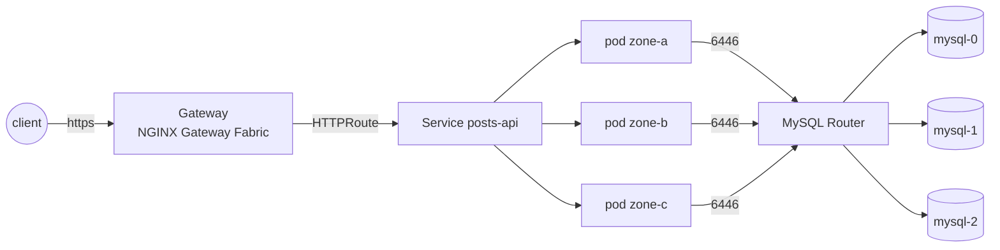

# infrastructure-interview

A small posts API (Express + TypeORM + MySQL) packaged and deployed the way I would run
it in production: containerized, highly available across three zones, observable, and
reproducible from a single command on a local kind cluster.

## Architecture



The kind cluster has one control-plane node and three workers, each labelled as a
different `topology.kubernetes.io/zone` (`zone-a`, `zone-b`, `zone-c`). Host ports 80
and 443 map to nodePorts 30080/30443 on the `zone-a` worker, so a request into the
cluster lands on that node's kube-proxy and gets forwarded no matter which zone
answers it.

Traffic enters through a Gateway API `Gateway` (`gateway/gateway`) served by NGINX
Gateway Fabric. The HTTP listener only redirects to HTTPS; the HTTPS listener
terminates TLS for `*.local.test` using a certificate issued by a local CA that
cert-manager creates on cluster bootstrap: a self-signed root, then a CA certificate,
then a `ClusterIssuer` backed by that CA.

The app runs as a Deployment with 3 replicas, spread across zones with a
`topologySpreadConstraint` (`maxSkew: 1`, `whenUnsatisfiable: DoNotSchedule`) and a
preferred pod anti-affinity by hostname. A PodDisruptionBudget keeps at least 2
replicas available during voluntary disruption. A HorizontalPodAutoscaler scales on
CPU between 3 and 10 replicas in the chart defaults; the local values file caps
`maxReplicas` at 6 to fit an 8 GB host. A NetworkPolicy restricts the pod to traffic
from the Gateway namespace, the monitoring namespace, and itself, and only allows
egress to the MySQL router, DNS, and itself.

MySQL is an InnoDB Cluster managed by the official MySQL Operator: three server
instances, one per zone via the same topology spread constraint, and two MySQL
Router instances in front of them. The app never talks to a MySQL server directly.
It connects to the router on port 6446, and the router routes to whichever instance
is currently primary. Schema migrations run as a Helm `pre-install`/`pre-upgrade`
hook Job, so a `helm upgrade` always applies pending migrations before the new
Deployment rolls out.

Observability is a kube-prometheus-stack (Prometheus, Alertmanager, Grafana) plus
Loki and Alloy for logs. Grafana is reachable at `https://grafana.local.test`. The
chart ships an app dashboard, loaded through the kube-prometheus-stack dashboard
sidecar, and three `PrometheusRule` alerts: `PostsApiHighErrorRate`,
`PostsApiHighLatency`, and `PostsApiReplicasBelowPDB` (see
[Operations](#operations)).

The platform (kind cluster, Gateway/cert-manager/observability addons, MySQL cluster)
is provisioned with OpenTofu and Terragrunt: reusable modules under
`infra/modules`, thin per-unit wiring under `infra/units`, and one environment,
`infra/environments/local`, that assembles the units into a Terragrunt stack. The
app itself deploys separately with plain Helm through `scripts/helm/deploy-app.sh`,
because the platform changes rarely and the app changes on every commit; forcing both
through the same tool and the same release cadence would slow the app down for no
reason.

The image is a multi-stage, distroless, non-root, multi-architecture build
(`linux/amd64`, `linux/arm64`), signed with cosign on release. CI scans it with
Trivy on every build. A dated `.trivyignore` covers CVEs that are only fixed in
a base image Google has not republished yet, with a comment saying why and when to
drop each entry.

## Requirements

- Docker.
- [mise](https://mise.jdx.dev), then `make setup` (`mise install` plus
  `pre-commit install`). Every tool version used here, Node, OpenTofu, Terragrunt,
  Helm, kind, kubectl, k6, and the linters used in CI, is pinned in `mise.toml`.
- At least 8 GB of RAM. The local Helm values (autoscaling cap, Prometheus retention,
  single-binary Loki) are sized for a 7.6 GB host; more headroom just means fewer
  scheduling squeezes under load or chaos tests.
- inotify limits high enough for kind and kube-proxy. The Linux/WSL2 default of 128
  is too low, and kind fails with "too many open files". Set:

  ```bash
  sudo sysctl -w fs.inotify.max_user_instances=512
  sudo sysctl -w fs.inotify.max_user_watches=1048576
  ```

- Ports 80 and 443 free on the host. They are what kind maps to the Gateway
  nodePorts.
- `make hosts` writes to `/etc/hosts` and asks for `sudo`.

## Quick start

```bash
make setup    # install pinned tools, register pre-commit hooks
make up       # kind cluster + platform addons + mysql + build + deploy
make hosts    # add posts.local.test and grafana.local.test to /etc/hosts
make test     # k6 functional smoke test
make load     # k6 load test (SLO: error rate <1%, p95 <300ms)
make chaos    # four failure scenarios, each run under load
make down     # destroy everything
```

URLs: `https://posts.local.test` (API) and `https://grafana.local.test` (Grafana;
`make grafana` prints the admin password).

## Repository layout

| Path                    | Contents                                                                 |
| ------------------------ | ------------------------------------------------------------------------ |
| `app/`                   | The posts API: Express, TypeORM, migrations, Dockerfile.                |
| `charts/posts-api/`      | Helm chart for the app (Deployment, HPA, PDB, NetworkPolicy, alerts, migration hook). |
| `values/posts-api/`      | Environment values layered on the chart defaults (`common.yaml`, `local.yaml`). |
| `infra/modules/`         | OpenTofu modules: `kind-cluster`, `platform-addons`, `mysql-cluster`.   |
| `infra/units/`           | Terragrunt wiring per module (source, dependencies, inputs).            |
| `infra/environments/`    | The `local` environment: a Terragrunt stack over the three units.       |
| `scripts/`               | Operational scripts (deploy, drain, hosts file, pull secret, Grafana creds). |
| `tests/`                 | k6 smoke/load scripts and the chaos scenario scripts.                   |

## Design decisions

#### MySQL 8 InnoDB Cluster instead of MariaDB 5.5

The original stack ran MariaDB 5.5, which is out of support and has no first-class
Kubernetes operator story. MySQL 8 with the official MySQL Operator gives group
replication, automatic primary election, and a router that the app can point at
without knowing which instance is primary, which is what "highly available across
zones" actually requires.

#### Migrations instead of `synchronize`

TypeORM's `synchronize: true` diffs entities against the live schema and applies the
result directly. That's convenient for a prototype and unsafe for anything with data
in it. Migrations are explicit, reviewable, and run once per deploy as a Helm hook,
so a rollout never carries an untracked schema change along with it.

#### Gateway API and NGINX Gateway Fabric instead of ingress-nginx

ingress-nginx is in maintenance mode with no further feature development. The
Gateway API is where routing configuration is headed, and NGF is a maintained
implementation of it. Using `HTTPRoute` from the chart also means the app does not
need ingress-controller-specific annotations.

#### cert-manager with a local CA, not an ACME issuer

There is no public DNS record to prove ownership of on a kind cluster, so a local CA
is the practical way to get real TLS for `*.local.test`. A real environment would
swap the `ClusterIssuer` for Let's Encrypt or another ACME issuer; nothing else in
the chart or Gateway configuration would need to change.

#### OpenTofu and Terragrunt for the platform, plain Helm for the app

OpenTofu rather than Terraform: HashiCorp relicensed Terraform under the BSL in
2023, and OpenTofu is the Linux Foundation fork that stayed open source. It is a
drop-in replacement for the code here and resolves the same providers from the
same registry.

The platform (cluster, addons, database) changes rarely and benefits from
Terraform-style state and plan/apply review. The app changes on every commit and
needs a fast, ordinary `helm upgrade` path, including from CI. Splitting them means
an app deploy never waits on a `tofu plan`, and a platform change never gets bundled
into an app release.

#### Distroless, non-root, cosign-signed image

The runtime image has no shell, no package manager, and no root user, which shrinks
what an attacker can do with a container escape or a dependency compromise. Cosign
signing on release gives anyone pulling the image a way to verify it came from this
pipeline.

#### App modernization (Node 22, TypeORM 0.3, TypeScript 5)

The original app targeted an EOL Node line and an old TypeORM major version with a
callback-heavy API. Moving to current majors is a normal maintenance step, and it
unblocks distroless images, which only ship supported runtimes.

#### Cost

Nothing here bills, but the same choices are what keep a real bill down. `e2e.yaml`
is `workflow_dispatch` only, so a kind cluster is not built on every push and the
expensive job runs when someone asks for it. Prometheus keeps 24h of data, which is
enough to read a chaos run and small enough to fit the single node it runs on. Every
workload declares requests and limits, so the scheduler packs nodes instead of
guessing, and the HPA is capped (`maxReplicas` 6 locally) so a traffic spike cannot
scale the bill without a ceiling. Observability runs as a single-node stack with a
single-binary Loki rather than a distributed one, which is the right trade at this
size and the first thing to revisit at a larger one.

#### What was left out on purpose

Authentication, pagination, rate limiting, and a unit test suite are not in `app/`.
None of them change how the infrastructure around the app has to behave, and the
brief for this exercise is the infrastructure, not the API. Correctness is instead
covered end to end: the k6 smoke test exercises every route and every documented
error path, and the chaos scenarios exercise the app under real failures. There is
also no cloud environment; everything here runs on a local kind cluster, and the
decisions above already call out where a cloud deployment would differ, most
obviously an ACME issuer instead of a local CA.

## Testing and chaos scenarios

`tests/load/smoke.js` is a functional check: it creates a post, lists posts, reads
the created post by id, and checks the documented error responses (404 on an unknown
id, 400 on an invalid body). `make test` runs it with 1 VU and 1 iteration.

`tests/load/load.js` is a load test: it seeds one post, then runs a mix of 80% reads
against that post and 20% writes, ramping to `VUS` virtual users (default 20, set via
the `VUS` env var) and holding for `DURATION` (default 2m, set via the `DURATION` env
var). It asserts an error rate under 1% and a p95 latency under 300ms; a failed
threshold makes k6 exit non-zero.

`make chaos` runs four scenarios, in this order. Each one starts the load test in the
background, injects a fault, and then checks that the same load test still met its
SLO; the chaos scripts fail the same way the load test does, on a non-zero k6 exit
code.

| Scenario           | Script                       | What it does                                                          | Expected outcome                                                                                   |
| ------------------- | ----------------------------- | ------------------------------------------------------------------------ | ----------------------------------------------------------------------------------------------------- |
| Zone outage         | `zone-outage.sh`              | Cordons and drains every node in one zone while load runs.               | The PDB holds; the replica scheduled in that zone stays `Pending` until the zone comes back. MySQL reports 2/3 online instances during the outage, then 3/3 once the zone returns. |
| MySQL primary kill  | `mysql-primary-kill.sh`       | Finds the current InnoDB Cluster primary and deletes its pod.            | Group replication elects a new primary; the MySQL Router fails writes and reads over to it without the app being restarted. |
| Rolling upgrade     | `rolling-upgrade.sh`          | Restarts the Deployment (`kubectl rollout restart`) under load.          | The rollout completes with no SLO violation, the same effect as a `helm upgrade` to a new image tag. |
| Random pod kill     | `pod-kill.sh`                 | Deletes a random `posts-api` pod, eight times, ten seconds apart.        | Kubernetes reschedules each pod; the SLO holds throughout.                                            |

Latest full run: 4/4 scenarios passed, with p95 latency of 91ms, 146ms, 159ms, and
179ms and an error rate of 0%, 0.42%, 0%, and 0% respectively, in the order above.

## Operations

#### Node maintenance

`make drain NODE=<name>` runs `kubectl drain` with `--ignore-daemonsets
--delete-emptydir-data`, which respects the PodDisruptionBudget: if draining the
node would take `posts-api` below `minAvailable: 2`, the drain blocks instead of
evicting. Run `kubectl uncordon <name>` once maintenance is done.

#### MySQL failover

Losing a single MySQL instance is self-healing: group replication elects a new
primary automatically and the router redirects traffic to it, with no operator
intervention needed. This is what the "MySQL primary kill" chaos scenario checks.

The MySQL Routers restart when the cluster loses quorum, which is what the chaos
scenarios provoke; they recover on their own once the cluster is ONLINE again.

#### Recovering from a full outage

If every MySQL pod restarts at once, a host reboot, for example, group replication
cannot elect a primary on its own, because no member has enough of the others online
to reach quorum. The InnoDB Cluster needs a manual reboot from complete outage, run
from a `mysqlsh` shell in one of the MySQL pods:

```bash
PW=$(kubectl -n mysql get secret mysql-root -o jsonpath='{.data.rootPassword}' | base64 -d)
kubectl -n mysql exec -it mysql-0 -c mysql -- mysqlsh -uroot -p"$PW" \
  -e "dba.rebootClusterFromCompleteOutage()"
```

#### Alerts

The chart ships three `PrometheusRule` alerts, visible in Alertmanager and Grafana:

| Alert                        | Fires when                                                     | Check first                                                        |
| ------------------------------ | ------------------------------------------------------------------ | ---------------------------------------------------------------------- |
| `PostsApiHighErrorRate`        | 5xx rate over 1% of requests for 5 minutes.                        | Recent deploys or migrations; app logs in Loki for the failing route.  |
| `PostsApiHighLatency`          | p95 request latency over 500ms for 5 minutes.                      | MySQL router/InnoDB Cluster health; whether the HPA is scaling; node CPU. |
| `PostsApiReplicasBelowPDB`     | Ready replicas below the PDB `minAvailable` for 2 minutes.         | `kubectl get pods -n posts-api`, node status per zone, recent rollout status. |

The alert thresholds are deliberately looser than the k6 load-test SLO (p95 <300ms).
The SLO is what the chaos scripts assert automatically during a fault; the alerts
are what a human gets paged on.

## CI/CD

`ci.yaml` runs on every pull request and every push to `develop` or `main`, as four
independent jobs: `app` (lint, format check, build, Docker build, Trivy scan),
`chart` (helm lint, `helm-docs` drift check, `helm template` validated against
Kubernetes and CRD schemas with `kubeconform`, and, on pull requests, a check that
`Chart.yaml`'s version was bumped whenever `charts/` changed), `infra` (`tofu fmt`,
`terragrunt hcl fmt`, `terraform-docs` drift check and `tflint` per module,
`terragrunt stack run validate`), and `lint` (`pre-commit run --all-files`,
`actionlint`).

`e2e.yaml` runs on `workflow_dispatch` only, to avoid spinning up a kind cluster on
every push. It provisions the platform on the runner, builds and deploys the app,
runs the k6 smoke test and `helm test`, and uploads pod, event, and log diagnostics
if anything fails.

`release.yaml` runs on any `v*` tag. It builds and pushes a multi-arch image to
`docker.io/skizay/posts-api` (tagged with the version and `latest`) and
`docker.io/skizay/posts-api-private` (tagged with the version only), signs the
public image with cosign in keyless mode, packages the Helm chart and pushes it as
an OCI artifact to `oci://ghcr.io/arthursampaio13/charts` (a separate registry path,
so the chart and the image never compete for the same tag), and creates a GitHub Release
with generated notes. It fails early if `Chart.yaml`'s version does not match the
tag, so the chart and the image never disagree about which version they are; the
chart is at `0.2.0`, so the first release tag is `v0.2.0`. It needs the
`DOCKERHUB_USERNAME` and `DOCKERHUB_TOKEN` repo secrets. Releases are tagged on
`main`, which stays a rebase of `develop`.

## Private registry

To pull from `skizay/posts-api-private` instead of the public repository, create a
pull secret from a Docker Hub token:

```bash
DOCKERHUB_USERNAME=<user> DOCKERHUB_TOKEN=<token> scripts/registry/create-pull-secret.sh
make deploy REGISTRY=private TAG=0.2.0
```

The tag is explicit because `release.yaml` only ever pushes released version tags to
`skizay/posts-api-private`. The default `TAG=dev` belongs to the local build path,
which loads the image straight into the kind nodes and never pushes it anywhere.

The script creates a `dockerhub` image pull secret in the `posts-api` namespace.
`REGISTRY=private` points the deploy at the private repository and adds that secret
to the Deployment's `imagePullSecrets`.
